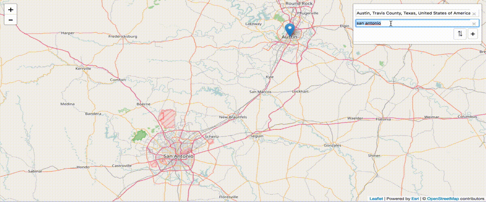

# Leaflet Routing Machine - Esri plugin

> enables walk, drive and truck routing using Esri's hosted service.

### Demo
Check out the live [demo](http://jgravois.github.io/lrm-esri/examples/index.html).

### Usage



```html
<script src="./lrm-esri.js"></script>
```

```js
/*
additional profiles:
Walking, Trucking, Rural Driving, Walking Distance, Trucking Distance, Driving Distance and Rural Driving Distance
*/
var control = L.Routing.control({
	router: L.Routing.esri({
    liveTraffic: true,
    profile: 'Driving'
  })
}).addTo(map);
```
### Features

Esri's hosted routing service can find the shortest driving, truck and walk time *or* distance for up to 150 input stops. It is able to incorporate both live and historic traffic and can reorder input stops to find the optimal sequence.

## Authentication

### Use a proxied service

You can allow anonymous users to get directions in your application by leveraging a proxied service - [live demo](http://jgravois.github.io/lrm-esri/examples/index.html)

1. Sign up for a [free developer account](https://developers.arcgis.com/)
2. Create your own [proxied service url](https://developers.arcgis.com/authentication/working-with-proxies/#arcgis-online-hosted-proxy)
3. supply the `url` in the provider constructor

```js
var control = L.Routing.control({
  router: L.Routing.esri({
    url: '<your proxied service url>'
  })
}).addTo(map);
```

When credentials are embedded, 1250 requests/month are provided for free. [Deployment packs](https://developers.arcgis.com/credits/) are available to help you scale.

### Use OAuth2

You can also use [OAuth2](https://developers.arcgis.com/authentication/) and bill routing charges directly to existing ArcGIS users - [live demo](https://johngravois.com/lrm-esri/examples/oauth/index.html)

1. Sign up for a [free developer account](https://developers.arcgis.com/)
2. Create and register a new application
3. Reference your `clientID` in your app and configure a `redirectUri`
4. after the user signs in, supply their `token` in the provider constructor (more info [here](https://developers.arcgis.com/authentication/browser-based-user-logins/))

```js
var control = L.Routing.control({
  router: L.Routing.esri({
    token: '<user token>'
  })
}).addTo(map);
```

### Development Instructions

If you'd like to inspect and modify the source code, follow the instructions below to set up a local development environment.

1. [Fork and clone](https://help.github.com/articles/fork-a-repo)
2. `cd` into the `lrm-esri` folder
3. Install the `package.json` dependencies by running `npm install`
4. Run `npm start` from the command line. This will recompile minified source in the `dist` directory, launch a tiny webserver and begin watching the raw source for changes.
5. Run http://localhost:8080/examples/index.html to check out your changes
6. Create a [pull request](https://help.github.com/articles/creating-a-pull-request)

### Dependencies

* leaflet
* leaflet-routing-machine
* cors-lite
* ~~esri-leaflet~~

### Resources

* [ArcGIS for Developers](http://developers.arcgis.com)
* [REST documentation for routing service](http://resources.arcgis.com/en/help/arcgis-rest-api/index.html#/Route_service_with_synchronous_execution/02r300000036000000/)

### Issues

Find a bug or want to request a new feature?  Please let us know by submitting an [issue](https://github.com/jgravois/lrm-esri/issues).

### Contributing

Esri welcomes contributions from anyone and everyone. Please see our [guidelines for contributing](https://github.com/Esri/esri-leaflet/blob/master/CONTRIBUTING.md).

### Caveats

Many Esri routing service features have *not* been implemented

* barriers
* route optimization
* driving, trucking and walking *distance*
* time windows
* routing for emergency vehicles

### Licensing
Copyright 2017 Esri

Licensed under the Apache License, Version 2.0 (the "License");
you may not use this file except in compliance with the License.
You may obtain a copy of the License at

> http://www.apache.org/licenses/LICENSE-2.0

Unless required by applicable law or agreed to in writing, software
distributed under the License is distributed on an "AS IS" BASIS,
WITHOUT WARRANTIES OR CONDITIONS OF ANY KIND, either express or implied.
See the License for the specific language governing permissions and
limitations under the License.

A copy of the license is available in the repository's [LICENSE](./LICENSE) file.